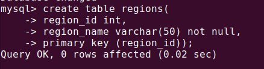
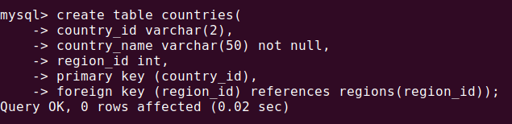
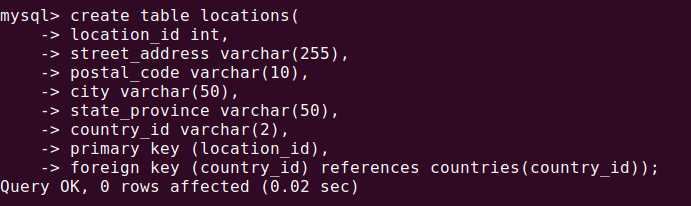
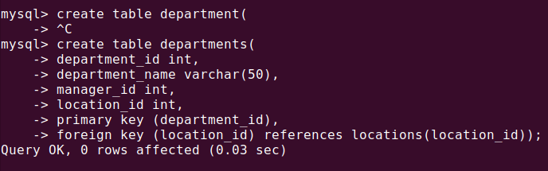
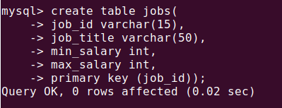
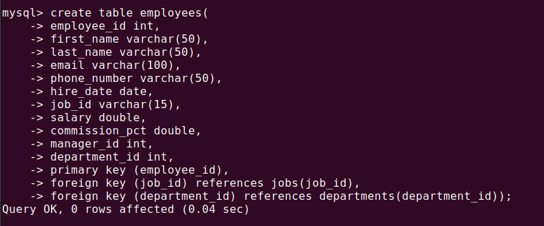
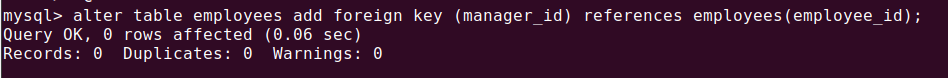
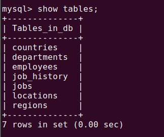
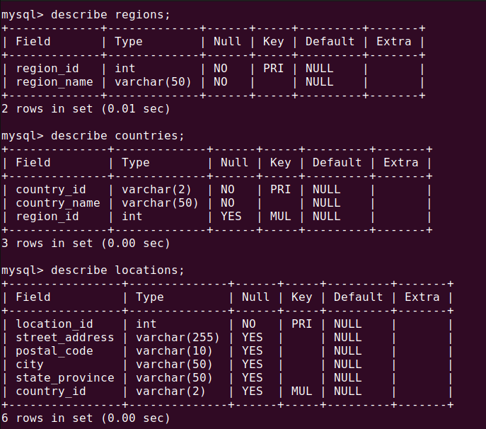
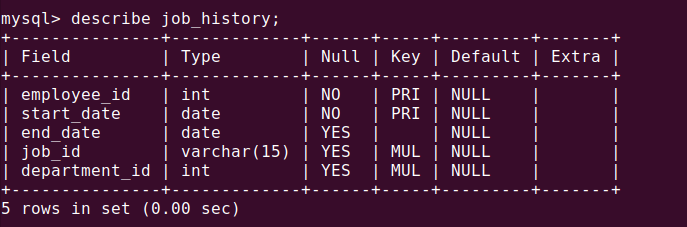

# Assignment 1

## Creation of REGIONS table

## Creation of COUNTRIES table

## Creation of LOCATIONS table

## Creation of DEPARTMENTS table

## Creation of JOBS table

## Creation of EMPLOYEES table

## Updating EMPLOYEES table with manager_id as foreign key referencing employee_id of EMPLOYEES table

## Updating DEPARTMENTS table with manager_id as foreign keyEMPLOYEES  referencing employee_id of EMPLOYEES table

## Creation of JOB HISTORY table

## Show tables

## Describe tables

